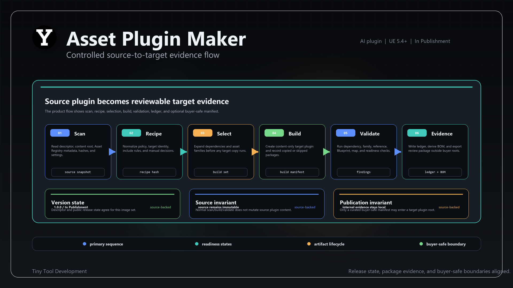

# Asset Plugin Maker

> Not a verbatim copy of shipped docs. This online page is an overview and routing surface; shipped buyer docs stay in the plugin package.

Asset Plugin Maker (APM) turns selected Content Browser assets and folders into clean, versioned
content plugins. It records source links, mappings, validation results, provenance, bills of
materials, and update evidence so generated plugins can be reviewed and maintained instead of
becoming one-off copies.

The same evidence-first foundation also supports profile-driven multi-pack decomposition and
cross-project plugin operations. APM can inventory another Unreal project without opening it,
discover plugins in nested category folders, rank dependencies, identify mirrored code plugins,
and prepare approval-gated export or adoption work for a reviewed composition manifest.

For content-pack descriptors, project-owned `/Game` content remains an execution dependency only:
APM retains its graph edge and build order but never writes a `ProjectContent` pack name into a
plugin's `.uplugin` dependencies, including names supplied through explicit `plugin_dependencies`.
Class compatibility likewise accepts only type-matched `Class` redirects; Struct or Enum redirects
cannot satisfy a class import.

## Get It / Routing

- Fab: not listed yet
- Status: In Publishment
- Engine baseline: Unreal Engine 5.4+
- Package docs: shipped inside the plugin package as `Documentation/QUICKSTART.md`,
  `Documentation/UserManual.md`, `Documentation/SettingsReference.md`,
  `Documentation/TROUBLESHOOTING.md`, `Documentation/FAQ.md`, and
  `Documentation/THIRD_PARTY_SOFTWARE.md`.
- Category: AI Plugins

## What It Does

- Creates a new Asset Plugin from selected project assets and folders.
- Adds selected assets to an existing managed Asset Plugin.
- Tracks source links and compares later source changes before promoting a new version.
- Compiles and executes reviewed multi-pack content plans.
- Inventories foreign project roots recursively, including nested plugin categories.
- Exports or adopts project plugins only through an approved, dry-run-first composition flow.
- Writes provenance, BOM, validation, update, operation-journal, and release-candidate evidence.
- Keeps full internal evidence out of buyer plugin roots by default.

## Typical Workflow

1. Open `Tiny Tools -> Asset Tools -> Asset Plugin Maker`.
2. Select assets or folders in the Content Browser.
3. Choose `Make Asset Plugin` or `Add To Asset Plugin`.
4. Review the selected packages and target settings.
5. Create or update the plugin, then inspect its source-link and validation evidence.

For advanced automation, use the shipped APM commandlets, Blueprint facade, or UCM routes. The
cross-project route family separates read-only inventory from approval-gated export/adoption and
preserves the reviewed manifest as the mutation authority.

## Cross-Product Workflow

APM is the packaging owner in the
[cross-project composition workflow](../../workflows/cross-project-composition.md). Project
Intelligence Orchestrator compiles and validates the composition manifest; APM remains responsible
for inventory, dependency checks, export, adoption, and the resulting journal evidence.

## Publication Boundary

APM creates technical readiness evidence. It does not grant redistribution rights, does not provide legal approval, and does not submit anything to Fab. Human review remains required before publication.

## Media

Product slides are maintained by the Product Presentation region. The current slide set is marked dirty internally until Slot 01 and Slot 02 are backed by real Unreal Editor screenshots.

