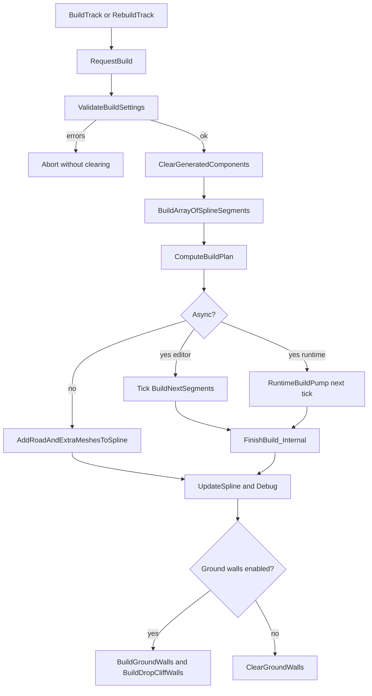

# Technical Overview

This overview is for maintainers who need to understand how the plugin is put together.

## Modules

### AsyncSplineBuilder

Runtime module. Contains:

- `ASplineGeneratingActor`
- spline mesh generation
- async build state machine
- ground wall and drop wall generation
- data asset save/load
- runtime-safe trace and cleanup helpers

### AsyncSplineBuilderEditor

Uncooked editor module. Contains:

- workflow-first Slate panel
- landscape height deformation
- editor selection ignore-list helpers
- module startup binding of editor delegates

The runtime module does not directly depend on the editor module.

## Main Types

- `ASplineGeneratingActor`: main actor and build orchestrator.
- `FTrackSplineData`: per-segment road, extra mesh, and wall configuration.
- `FGroundWallSettings`: per-segment procedural wall configuration.
- `FTrackSegmentPlan`: immutable segment decision used during a build.
- `FTrackBuildPlan`: array of segment plans computed before generation.
- `USplinePointListAsset`: data asset for spline point persistence.
- `SAsyncSplineBuilderPanel`: editor-only workflow panel for normal setup and build actions.
- `FTrackShapeEditorOperations`: shared editor operation service for native track-shape layout, anchor, and segment mutations.
- `STrackShapeEditorPanel`: editor-only Track Shape Editor surface with viewport, layout list, inspector, JSON import/export, apply flow, and automation seams.

Multi-layout and connector types:

- `FAsyncSplineLayout`: route-level record for main track, pit lane, alternate layout, service road, or decorative spline.
- `FAsyncSplineLayoutBuildContext`: adapter passed to builder helpers so layout-specific spline, segment data, gaps, drops, build plan, and dirty cache are not read from actor globals.
- `FAsyncSplineBuildWorkItem`: async queue item carrying layout, segment, mesh slot, and piece ownership.
- `FAsyncSplineLayoutConnector`: passive semantic link between two layout distances, used for `PitEntry`, `PitExit`, `Link`, `ServiceAccess`, or custom connector kinds.

## Editor UI Flow

The editor module registers a hidden nomad tab and exposes it through **Tools > Track Tools > Async Spline Builder**. The panel talks to the selected or created `ASplineGeneratingActor` through editor-only facade methods on the actor.

The UI is intentionally workflow-shaped:

1. resolve or create the actor
2. assign core meshes
3. validate before destructive rebuilds
4. choose synchronous or batched generation
5. prepare per-segment data rows
6. assign landscape and run manual height deformation

Advanced raw configuration remains in the Details panel.

The native Track Shape Editor is the focused multi-layout authoring surface. It edits `FTrackShapeDocument` through shared operation services so viewport gestures, designer buttons, and automation seams mutate layouts, anchors, and segments consistently before validation/compile/apply.

## Build Flow

## Validation Contract

`ValidateBuildSettings()` returns `FBuildValidationResult`.

Blocking errors stop builds before old generated components are cleared. Warnings are logged but allow the build to continue.

Examples of blocking errors:

- missing `MainMesh`
- ground walls enabled without trace object types
- landscape snapping enabled without trace object types
- invalid gap or drop ranges

## Build Plan Contract

`ComputeBuildPlan()` is the single source of truth for:

- segment start/end distances
- selected road mesh
- piece count
- piece length
- jump gap status
- drop status and height
- extra mesh count

Road generation, extra mesh generation, wall width lookup, and landscape deformation should use the plan when possible.

## Multi-Layout And Connector Contract

The actor keeps the legacy `TrackSpline`/`TrackSplineData` fields as the `Main` layout facade and adds a layout layer above the existing segment renderer.

Responsibilities:

- layout data owns route identity, enabled state, layout kind, open/closed-loop policy, spline reference, per-layout segment data, gaps, and drops
- segment data continues to own road mesh, extra meshes, mesh length, piece count, and ground-wall settings
- build helpers receive a layout context instead of reading `TrackSpline`, `TrackSplineData`, `JumpGapsByPoints`, `StuntDropsByPoints`, `SplineSegments`, and `BuildPlan` directly from the actor
- generated components receive both role tags and `AsyncSplineBuilder.Layout.<LayoutId>` ownership tags
- connector records describe intent between two layouts and are exposed through the actor facade, editor panel, and MCP/UCM read/apply/remove/clear/validate tools

Pit lanes and alternate layouts are ordinary layouts. Connectors do not create transition geometry, cut/merge splines, alter terrain deformation, or trigger a special pit-lane renderer. Connector validation reports errors and warnings through `ValidateLayoutConnectors()`, read JSON, MCP tools, and the panel; `ValidateBuildSettings()` folds in connector warnings only so connector mistakes never block a geometry rebuild.

## Connector Debug Visualization

Connector debug is optional, visual-only output. The **Show Connector Debug** checkbox in the panel's **Layout Connectors** section controls `bShowLayoutConnectorDebug`; changing it refreshes or clears endpoint labels and does not request a track rebuild or change validation state.

When enabled, `RefreshConnectorDebugVisualization()` resolves the `From` and `To` endpoints independently through `GetEditorSplineForLayout()`. Each resolvable, finite, in-range endpoint on a usable spline receives a `UTextRenderComponent` marker labelled with the connector index, connector kind, endpoint role, layout id, and distance. A missing or unusable spline, non-finite distance, or out-of-range endpoint is skipped instead of displaying a misleading position; connector validation remains the source of the corresponding error or warning.

Connector markers have an isolated identity and lifecycle:

- common generated/debug tags: `AsyncSplineBuilder.Generated` and `AsyncSplineBuilder.DebugText`
- connector ownership: `AsyncSplineBuilder.ConnectorDebug` and `AsyncSplineBuilder.Connector.<Index>`
- endpoint role: `AsyncSplineBuilder.Connector.From` or `AsyncSplineBuilder.Connector.To`
- layout ownership: `AsyncSplineBuilder.Layout.<LayoutId>`
- no segment ownership tag

Enabling the toggle, editing connector metadata while it is enabled, and normal debug/build finalization refresh the markers. Disabling it or running full generated-component cleanup clears them by the connector-debug tag while ordinary point/segment debug text remains independent. They are not stored in the road, extra-mesh, ground-wall, or drop-wall registries, and segment-targeted cleanup does not select them. The visualization therefore does not create connector road geometry, alter terrain behavior, or change rebuild gating.

## Component Ownership

Generated components are tagged with:

- `AsyncSplineBuilder.Generated`
- a role tag such as `RoadMesh`, `ExtraMesh`, `GroundWall`, `DropWall`, or `DebugText`

Cleanup scans components by tag. This protects against stale transient arrays after construction, load, hot reload, or partial rebuilds.

Connector endpoint text also carries the dedicated `ConnectorDebug`, connector-row, endpoint-role, and layout tags described above. Connector cleanup scans that dedicated tag, while the absence of segment tags keeps those markers out of segment-targeted road cleanup.

## Async Model

The plugin does not create components from worker threads.

Instead:

- editor builds are debounced and pumped through actor tick
- runtime builds are pumped through `SetTimerForNextTick`
- each pump calls `BuildNextSegments(SegmentsPerTick)`

This keeps component registration on the game thread while still avoiding one large build spike.

## Ground Wall Model

Ground walls are procedural mesh strips. They are sampled along spline distance and split whenever a segment is invalid, disabled, too short, below `MinWallHeight`, or inside a jump gap.

Triangle generation uses previous/current sample pairs. This prevents forward references and invalid triangles at strip boundaries.

## Drop Wall Model

Drop walls are generated between adjacent non-gap segments when their boundary heights differ. They form a vertical quad across the road width at the boundary distance.

## Landscape Deformation Model

Landscape deformation is editor-only. The actor exposes `FLandscapeDeformParams`; the editor module consumes it. The deformer samples the road spline, projects candidate landscape samples to the closest point on the sampled route, and blends height according to road width plus falloff.

Additive global landscape layer weight painting is implemented in the editor module (`PaintLandscapeLayerNow`). The workflow panel exposes `PaintLayer`, `PaintHalfWidth`, `PaintFallOff`, and the **Paint Layer** action. `PaintFallOff = 0` is a hard edge. Weight-blended layer infos reduce other layers under the road; `bNoWeightBlend` layer infos are warned about because they do not guarantee that reduction. Replace/clear and per-segment paint are not implemented.

## Packaging

The runtime module is cross-platform for Win64, Linux, and Mac according to the `.uplugin`. The editor module is `UncookedOnly`.

Packaged games should not reference editor-only landscape deformation symbols.

## Maintenance Notes

- Keep generated-component role tags precise.
- Add layout ownership tags before enabling partial rebuilds across multiple layouts.
- Do not put editor-only landscape APIs in the runtime module.
- Do not create components off the game thread.
- Keep validation blocking only for states that would make the build destructive or meaningless.
- Add automation tests when changing build-plan, cleanup, connector, track-shape editor, gap/drop, or wall behavior.
