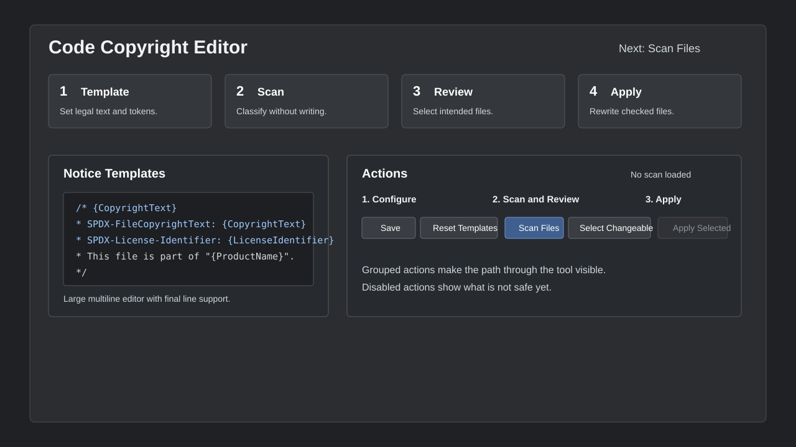
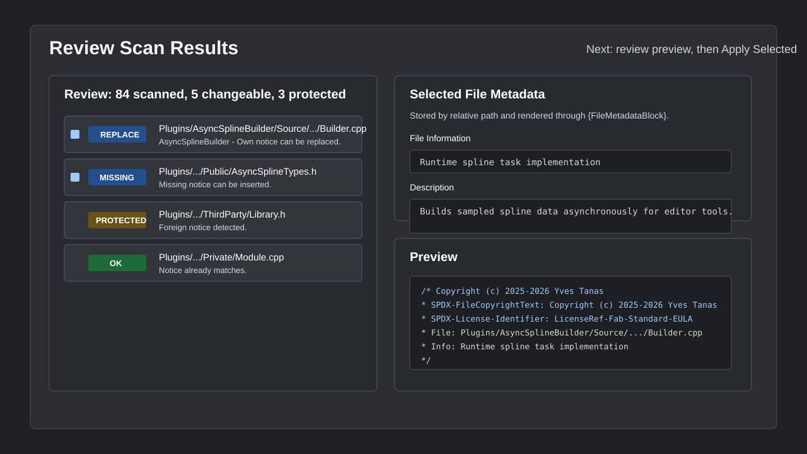
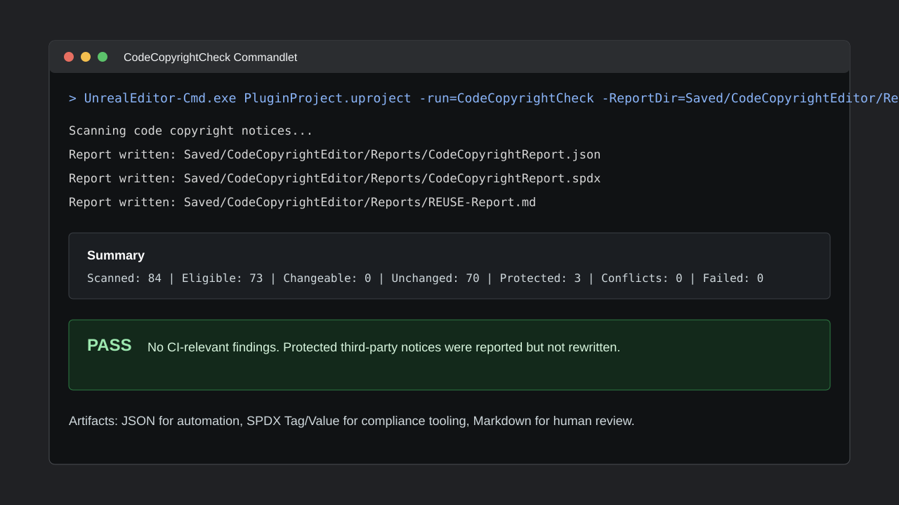

# Code Copyright Editor Documentation

Code Copyright Editor keeps Unreal Engine source headers consistent across a project. It can update the Project Settings copyright notice, scan the source tree, rewrite selected files, and run as a headless CI check.

This folder contains the complete documentation delivered with the plugin.

## Start Here

- [BuyerGuide.md](BuyerGuide.md): buyer-friendly introduction and practical workflows.
- [UserManual.md](UserManual.md): complete editor workflow and UI usage.
- [FAQ.md](FAQ.md): Fab-ready buyer questions and answers.

## Reference

- [SettingsReference.md](SettingsReference.md): every setting, default, and recommended baseline.
- [TemplateReference.md](TemplateReference.md): tokens, default templates, and metadata rendering.
- [CommandletAndCI.md](CommandletAndCI.md): commandlet usage, CI behavior, and examples.
- [ReportsAndCompliance.md](ReportsAndCompliance.md): JSON, SPDX-style, and REUSE-style report details.
- [Troubleshooting.md](Troubleshooting.md): common problems and fixes.
- [ReleaseChecklist.md](ReleaseChecklist.md): release and Fab submission checklist.
- [TechnicalOverview.md](TechnicalOverview.md): maintainer-level architecture overview.
- [CodeDocumentation.md](CodeDocumentation.md): source layout, code contracts, flows, and extension points.

## Included Assets

- [CI/GitHubActions-CodeCopyrightCheck.yml](CI/GitHubActions-CodeCopyrightCheck.yml): GitHub Actions starter workflow.
- [Screenshots/](Screenshots): documentation screenshots.



## Quick Editor Workflow

1. Open **Tools > Code Tools > Code Copyright Editor**.
2. Edit the source and project notice templates.
3. Use **Scan Files** to classify the codebase without writing files.
4. Review status badges and select only the files that should be rewritten.
5. Add optional per-file information and descriptions for selected files.
6. Use **Apply Selected** after reviewing the preview.



## Quick Template Tokens

Common tokens:

- `{CopyrightText}`
- `{OwnerName}`
- `{ContactEmail}`
- `{ProductName}`
- `{ModuleName}`
- `{FileName}`
- `{RelativeFilePath}`
- `{Year}`
- `{LicenseName}`
- `{LicenseUrl}`
- `{LicenseIdentifier}`
- `{FileInformation}`
- `{FileDescription}`
- `{FileMetadataBlock}`

For REUSE/SPDX-friendly headers, keep these two tags near the top of the template:

```text
/* {CopyrightText}
 * SPDX-FileCopyrightText: {CopyrightText}
 * SPDX-License-Identifier: {LicenseIdentifier}
```

## Commandlet

Run the same scanner from CI or a local terminal:

```powershell
UnrealEditor-Cmd.exe "D:\PluginProjectGit\PluginProject.uproject" -run=CodeCopyrightCheck -unattended -nop4 -nosplash -NoShaderCompile -ReportDir="Saved\CodeCopyrightEditor\Reports"
```

Useful switches:

- `-Fix`: rewrite changeable files before producing the final report.
- `-ReportDir=<Path>`: write reports to a project-relative or absolute directory.
- `-FailOnProtected`: treat protected foreign notices as CI failures.
- `-NoJson`, `-NoSpdx`, `-NoReuse`: skip individual report formats.
- `-NoFail`: write reports but always return exit code `0`.

By default, CI fails when files would be changed, conflicts exist, or files could not be read/written. Protected third-party notices are reported but do not fail the build unless `-FailOnProtected` is set.



## Quick Reports

The commandlet writes:

- `CodeCopyrightReport.json`: machine-readable scan summary.
- `CodeCopyrightReport.spdx`: SPDX 2.3 Tag/Value style report.
- `REUSE-Report.md`: human-readable REUSE/SPDX review report.

## Quick CI Template

A GitHub Actions starter file is included at:

```text
Plugins/CodeCopyrightEditor/Documentation/CI/GitHubActions-CodeCopyrightCheck.yml
```

It assumes a self-hosted runner with Unreal Engine installed. Adjust `UE_EDITOR_CMD` and `UPROJECT` for the runner machine.

## Legal Note

Code Copyright Editor helps apply and review notice text consistently. It does not decide ownership, validate third-party licenses, grant rights, or replace legal advice.

## References

- REUSE Specification 3.3: https://reuse.software/spec-3.3/
- SPDX Specification 2.3: https://spdx.github.io/spdx-spec/v2.3/
- Unreal Engine UCommandlet API: https://dev.epicgames.com/documentation/en-us/unreal-engine/API/Runtime/Engine/Commandlets/UCommandlet
